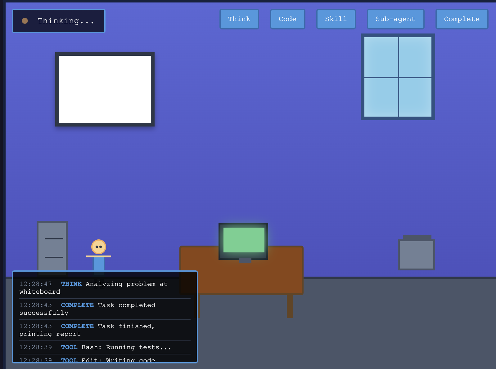

# claudeHQ

> A fun pixel art office that visualizes Claude Code activity in real-time

Watch Claude work in a charming pixel art office environment! See a little character move around their workspace as Claude Code performs different tasks - coding at the desk, thinking at the whiteboard, accessing skills from the filing cabinet, and more.



## Features

- **Real-time visualization** of Claude Code activities
- **Pixel art animations** showing different work states
- **WebSocket-based** live updates
- **Demo mode** for testing without Claude integration
- **Manual controls** for triggering animations
- **Event logging** to track activity history
- **Automatic reconnection** if server disconnects

## What You'll See

The visualization shows a pixel art office with:
- **Desk & Computer**: Where Claude codes (Read, Edit, Write, Bash, Grep, Glob tools)
- **Whiteboard**: Where Claude thinks and plans
- **Filing Cabinet**: Where Claude accesses skills
- **Printer**: Prints completed tasks
- **Window**: Natural lighting for ambiance

Watch the character move between these areas based on Claude's activities!

## Requirements

- Node.js (v14 or higher)
- npm
- A modern web browser

## Quick Start

### 1. Install Dependencies

```bash
npm install
```

### 2. Start the Server

```bash
# Normal mode (wait for events)
npm start

# Demo mode (auto-generates events every 4 seconds)
npm run demo
```

The server will start on:
- **Visualization**: http://localhost:8080
- **WebSocket**: ws://localhost:8081
- **Event API**: POST http://localhost:8080/event

### 3. Open the Visualization

Open your browser to http://localhost:8080 and watch the office come to life!

### 4. Test with Manual Events

In another terminal, run:

```bash
./test-events.sh
```

This will send a sequence of test events to see all the animations.

## Architecture

```
┌─────────────┐      ┌──────────────┐      ┌──────────────┐
│ Claude Code │─────▶│   WebSocket  │─────▶│  Browser     │
│  (events)   │ POST │    Server    │  WS  │ claudeHQ UI  │
└─────────────┘      └──────────────┘      └──────────────┘
```

**Components:**
- **server.js**: WebSocket server that receives events and broadcasts to clients
- **claudeHQ.html**: Browser visualization with real-time WebSocket connection
- **claude-hook.sh**: Optional hook script for Claude Code integration
- **test-events.sh**: Manual event testing script

## Animation Mapping

| Claude Event | Animation | Location |
|-------------|-----------|----------|
| Tool: Read/Edit/Write | Typing at desk | Main desk |
| Thinking blocks | Sketching whiteboard | Whiteboard |
| Skill usage | Filing cabinet | Left side |
| Sub-agent spawn | New person walks in | Door |
| Task complete | Printer → delivery | Printer → desk |

## Integration with Claude Code

### Option 1: Automatic Hooks (Recommended)

Set up Claude Code to automatically send events as it works. This requires Claude Code with hooks support.

**To enable hooks**, give Claude this prompt:

```
Add hooks to my Claude Code settings that POST to http://localhost:8080/event
when Claude uses tools. For each tool use, send a JSON event with type, tool
name, and timestamp. Use PreToolUse hook, curl with -s flag, and run in
background with async:true to avoid blocking Claude.
```

Claude will configure hooks in your settings.json that automatically send events for:
- Tool usage (Read, Edit, Write, Bash, Grep, Glob, etc.) → `type: "tool"`
- Sub-agent spawns (Agent tool) → `type: "agent"`
- Skill invocations (Skill tool) → `type: "skill"`

**To remove hooks**, give Claude this prompt:

```
Remove the claudeHQ hooks from my Claude Code settings. Look for the PreToolUse
hook that posts to http://localhost:8080/event and remove it from settings.json.
```

**Important:** Keep the claudeHQ server running (`npm start`) whenever you're using Claude Code, or events will be lost.

### Option 2: Manual Event Sending

Send events from any script:

```bash
curl -X POST http://localhost:8080/event \
  -H "Content-Type: application/json" \
  -d '{
    "type": "tool",
    "tool": "Read",
    "message": "Reading file.js",
    "timestamp": "'$(date -u +"%Y-%m-%dT%H:%M:%SZ")'"
  }'
```

### Option 3: Custom Monitoring

Create your own script to monitor Claude Code activity and POST events to the server.

## Event Format

All events should be JSON with this structure:

```json
{
  "type": "thinking",        // Event type: thinking, tool, agent, skill, complete
  "tool": "Read",            // Optional: specific tool name
  "message": "Reading...",   // Optional: descriptive message
  "timestamp": "2026-03-25T10:30:00Z"
}
```

**Event Types:**
- `thinking` - Character goes to whiteboard
- `tool` - Character works at desk (Read, Edit, Write, Bash, Grep, Glob)
- `agent` - New person walks in (sub-agent spawned)
- `skill` - Character accesses filing cabinet
- `complete` - Character prints and delivers report

## Next Steps

1. **Enhanced Visualizations**
   - More character animations
   - Different office themes
   - Sound effects
   - Multiple characters for parallel work

2. **Better Integration**
   - Direct Claude Code extension
   - Log file monitoring
   - Cloud sync for remote viewing

3. **Advanced Features**
   - Replay mode (time-lapse)
   - Statistics dashboard
   - Team mode (multiple developers)
   - Configurable office layouts

## Technical Notes

- WebSocket-based real-time updates
- Automatic reconnection on disconnect
- Falls back to manual mode if server unavailable
- Pixel art styling with CSS animations
- Event queue system for smooth transitions

## How It Works

1. **Server** (`server.js`) runs two services:
   - HTTP server on port 8080 (serves the HTML and receives events via POST)
   - WebSocket server on port 8081 (broadcasts events to connected clients)

2. **Client** (`claudeHQ.html`) connects via WebSocket and displays:
   - Animated pixel art office scene
   - Character that moves based on event types
   - Real-time event log
   - Manual control buttons for testing

3. **Events** are sent as JSON via HTTP POST and broadcast to all connected browsers in real-time

## Contributing

Contributions are welcome! Feel free to:
- Add new animations or office elements
- Improve the visualization
- Add sound effects
- Create new themes
- Enhance Claude Code integration

## License

MIT License - feel free to use and modify as you wish!
